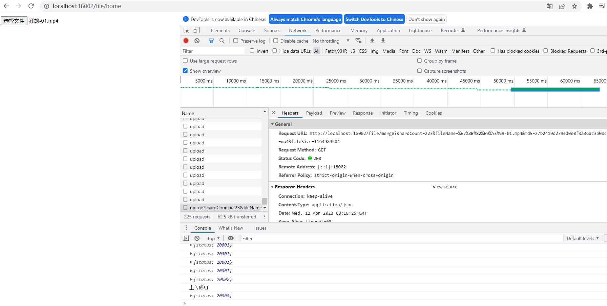

# minio-demo

学习MinIO使用的仓库，本仓库内容仅供学习使用

## 1 需要引入的依赖
```xml
<!-- https://mvnrepository.com/artifact/io.minio/minio -->
<dependency>
    <groupId>io.minio</groupId>
    <artifactId>minio</artifactId>
    <version>8.3.9</version>
</dependency>

```

## 2 测试文件上传

http://localhost:18002/file/home




## 3 测试视频播放

接口说明

```http
http://localhost:18002/video/home/{bucketName}/{objectName}

# bucketName 桶名称
# objectName 存入桶的对象名称
```


http://localhost:18002/video/home/minio-demo/3fc25449-dac9-4fd6-ad35-053d0938a071.mp4

